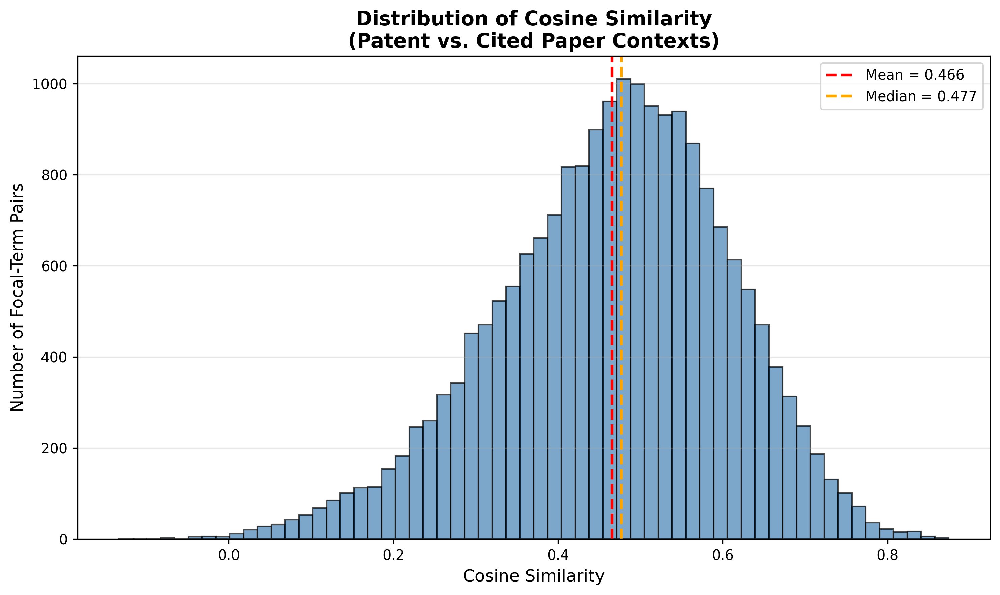

# Full Dataset (v3) Deliverable — Focal Terms Pipeline

**Dataset**: v3_16042026 (full sample)
**Date**: June 2026

---

## Data Sources

| File | Rows | Description |
|---|---|---|
| `FullSampleGloria_Pat_GlinerLabels_16042026.parquet` | 120,274,819 | Patent terms extracted by GLiNER |
| `FullSampleGloria_Link_PmidOa_16042026.parquet` | 26,768,791 | Patent-to-PubMed citation links |
| `FullSampleGloria_Pmed_GlinerLabels_16042026.parquet` | 207,304,318 | PubMed paper terms extracted by GLiNER |

---

## Task 1 — Identify Overlapping Terms ("Focal Terms")

### Method

For each patent:
1. Compile the set of GLiNER-extracted terms appearing in the patent.
2. Compile the set of GLiNER-extracted terms appearing in its cited PubMed papers (via the link table).
3. Identify the intersection of these two term sets.
4. These intersecting terms are the **focal terms** for that patent.

### Deliverable

A dataset (`focal_terms_full.parquet`) listing:

| Column | Type | Description |
|---|---|---|
| `patent_id` | string | Patent identifier |
| `focal_term` | string | The shared term |
| `freq_in_patent` | int | How many times the term appears in the patent |
| `freq_in_cited_paper` | int | Sum of occurrences across all cited papers |

---

## Task 2 — Measure Overlap Intensity

### Summary Statistics

| Statistic | Value |
|---|---|
| Total patents with focal terms | 474,011 |
| Mean focal terms per patent | 8.85 |
| Median focal terms per patent | 6 |
| Standard deviation | 8.66 |
| Min | 1 |
| Max | 158 |
| Patents with exactly 1 focal term | 50,352 (10.6%) |

### Distribution Plot


The distribution is **right-skewed**: the majority of patents share a small number of terms with their cited literature, while a minority overlap very broadly. The median of 6 focal terms per patent is the typical patent-paper relationship. The gap between mean (8.85) and median (6) confirms the skew: a small number of high-overlap patents pull the mean upward.

### Interpretation

- **10.6% of patents** have exactly 1 focal term -- minimal terminological overlap with cited science.
- The bulk of patents cluster between 1-20 focal terms.
- A long tail extends to 158 focal terms, representing patents with exceptionally broad scientific grounding. These are likely highly specialised biomedical/pharmaceutical patents referencing a dense body of scientific literature.

### Top 10 patents by focal-term overlap

| patent_id | num_focal_terms |
|---|---|
| 10493296 | 158 |
| 11505782 | 144 |
| 7111346 | 122 |
| 8206901 | 118 |
| 9109248 | 117 |
| 9821114 | 111 |
| 11065306 | 110 |
| 7666598 | 108 |
| 9679115 | 108 |
| 8389222 | 107 |

### Most frequent focal terms (top 20)

| Focal term | Frequency |
|---|---|
| method | 92,363 |
| cell | 61,388 |
| protein | 44,343 |
| human | 43,944 |
| effective | 37,710 |
| system | 36,647 |
| sequence | 32,576 |
| treatment | 29,180 |
| time | 28,895 |
| compound | 28,163 |

High-frequency terms (`method`, `cell`, `protein`) are generic biomedical vocabulary. More specific terms like `cancer`, `antibody`, `expression` (ranks 17-20) reveal the predominantly life-sciences character of the dataset.

---

## Task 3 — Compare Semantic Contexts

### Method

For each focal term, we extract its **context** -- the set of other GLiNER-extracted terms co-occurring in:
- the patent (patent context)
- the cited scientific papers (paper context)

Both context term lists are concatenated into strings and encoded using a sentence embedding model. Cosine similarity between the two embeddings measures how similar the semantic environment of the focal term is across patents and science.

**Sample size**: 20,000 focal-term pairs (sampled from the full dataset to keep computation feasible).

### Note on embedding model

We used **`all-MiniLM-L6-v2`** as a baseline model. This is a general-purpose sentence embedding model, **not specialised for biomedical text**. It was chosen as a first pass to establish the pipeline and baseline results. The approach is not ideal for two reasons:

1. **General-purpose model**: `all-MiniLM-L6-v2` is trained on general web text, not biomedical corpora. A specialised model (e.g., BioLORD, SapBERT) would better capture domain-specific semantic relationships.
2. **Term lists, not sentences**: the current pipeline embeds concatenated term lists rather than natural language sentences. Sentence embedding models are trained on grammatical text, so feeding them word lists is suboptimal. A future improvement would be to embed actual patent claims and paper sentences containing the focal term.

Despite these limitations, the baseline results reveal meaningful patterns and validate the pipeline structure.

### Quantitative Summary

| Statistic | Value |
|---|---|
| N pairs | 20,000 |
| Mean | 0.466 |
| Median | 0.477 |
| Std Dev | 0.141 |
| Q25 | 0.375 |
| Q75 | 0.564 |
| Min | -0.133 |
| Max | 0.874 |
| % above 0.5 | 43.0% |
| % below 0.2 | 4.1% |
| % negative | 0.1% |

### Distribution Plot



The distribution is approximately bell-shaped, centred around 0.45-0.50, with a slight left skew. Very few pairs score above 0.80 (near-identical contexts) or below 0.10 (unrelated contexts).

### Interpretation

Across 20,000 sampled focal-term pairs, the mean cosine similarity between patent and cited-paper contexts is **0.466** (median 0.477), indicating **moderate semantic overlap** overall.

- **43.0% of pairs** show similarity above 0.5, suggesting the focal term is used in a recognisably similar context in both patents and papers.
- **4.1% fall below 0.2**, meaning those focal terms appear in substantially different semantic environments.
- **Only 0.1% of pairs** have negative similarity, indicating near-opposite contexts -- these are rare.

Overall, the moderate average similarity (~0.47) suggests that patent-literature knowledge transfer is real but partial: patents do not simply copy scientific framing; they adapt terminology to an applied/technical context.

### Examples: High Similarity

| Patent | Focal term | Similarity | Patent context (sample) | Paper context (sample) |
|---|---|---|---|---|
| 10005683 | time | 0.874 | treatment, apparatus, nitrogen, reactor, aeration, ammonia | aeration, evaluation, gas, nitrate, nitrogen, anammox |
| 10005683 | growth | 0.869 | treatment, apparatus, nitrogen, reactor, aeration, ammonia | accumulation, bacteria, biological, carbon, control |
| 10004748 | letrozole | 0.868 | treatment, administering, therapeutically effective, breast cancer | aromatase, cancer, inhibitor, safety, chemotherapy |
| 10004748 | anastrozole | 0.845 | treatment, administering, therapeutically effective, breast cancer | analysis, antiestrogen, benefit, clinical, efficacy |
| 10004748 | tamoxifen | 0.842 | treatment, administering, therapeutically effective, breast cancer | aromatase, efficacy, postmenopausal, risk, biosynthesis |

High similarity occurs for **domain-specific terms** (drug names, enzymes, chemical compounds) with narrow, stable meanings used the same way in both patents and science.

### Examples: Low Similarity

| Patent | Focal term | Similarity | Patent context (sample) | Paper context (sample) |
|---|---|---|---|---|
| 10016380 | about | -0.133 | method, treating, solid, smooth, porous, surface, sanitize | cross-sectional, development, smoke, year-old, birth |
| 10011540 | range | -0.086 | method, chemical, oxidative coupling, methane, catalyst | 68-year-old, absent, age, anti-tumor, apoptosis |
| 10016364 | present | -0.071 | method, making, nanoemulsion, premix, oil-based | evaluation, bilaterally, bulbocavernosus, reflex |
| 10008141 | with | -0.068 | light field, display, device, array, element | 1540, age, annual, pediatrics, monomodal |
| 10009240 | from | -0.044 | method, associating, scores, policies, hosts, network | change, geophysics, gravitational, large, measure |

Low similarity occurs for **generic/function words** (`about`, `range`, `present`, `with`, `from`) that GLiNER extracted as entities but carry no domain-specific meaning. These terms are focal terms by coincidence -- they appear in both domains but have no shared semantic content. This highlights an opportunity to improve results by filtering stopwords and non-entity terms from the GLiNER output.

---

## Methodological Note

### Pipeline

1. **Term extraction**: GLiNER named entity recognition applied to patent texts and PubMed abstracts (performed upstream, not part of this pipeline).
2. **Focal term identification** (`01_focal_terms.py`): Inner join between patent terms and cited-paper terms via the patent-PMID link table. Each raw file (120M, 27M, 207M rows) is scanned exactly once using Polars' streaming engine.
3. **Overlap analysis** (`02_analysis.py`): Per-patent focal term counts, summary statistics, and distribution visualisation.
4. **Semantic comparison** (`03_semantic.py`): For a sample of 20,000 focal-term pairs, context term lists are extracted from both patents and papers, embedded with `all-MiniLM-L6-v2`, and compared via cosine similarity.

### Tools

- **Polars** (v1.41) for data processing -- lazy evaluation and streaming to handle 350M+ rows within GitHub Actions' 7GB RAM constraint.
- **sentence-transformers** (`all-MiniLM-L6-v2`) for context embeddings (baseline, general-purpose model).
- **GitHub Actions** for automated execution; **Cloudflare R2** for data storage.

### Limitations

- The embedding model (`all-MiniLM-L6-v2`) is a general-purpose baseline, not specialised for biomedical text. Results should be interpreted as a first approximation.
- Some GLiNER extractions include stopwords and non-entities (`about`, `with`, `from`, `30`), which add noise. Filtering these would improve both overlap statistics and semantic comparison quality.

---

## Output Files

```
output/
  focal_terms_full.parquet                  # Task 1: (patent_id, focal_term, freq_in_patent, freq_in_cited_paper)
  focal_term_counts_per_patent_full.parquet  # Task 2: (patent_id, num_focal_terms)
  term_frequency_full.parquet                # Task 2: (focal_term, frequency)
  task2_analysis.json                        # Task 2: summary statistics + examples
  task3_contexts_sample.parquet              # Task 3: context term lists (20k sample)
  task3_cosine_similarity_sample.parquet     # Task 3: similarity scores + context texts
  task3_semantic_summary.json                # Task 3: similarity statistics + examples

visualizations/v3_16042026/fullsample_visualizations/
  histogram_focal_terms_full.png             # Task 2: focal term count distribution
  task3_similarity_distribution.png          # Task 3: cosine similarity distribution
```
