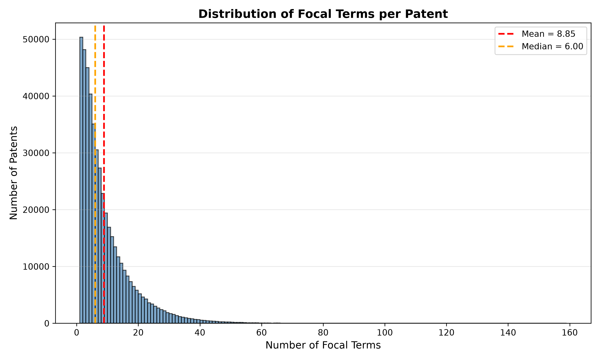
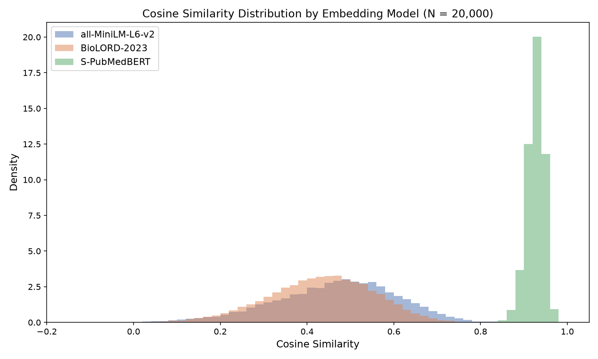
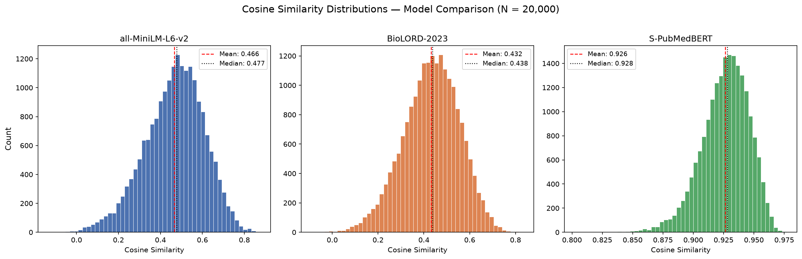
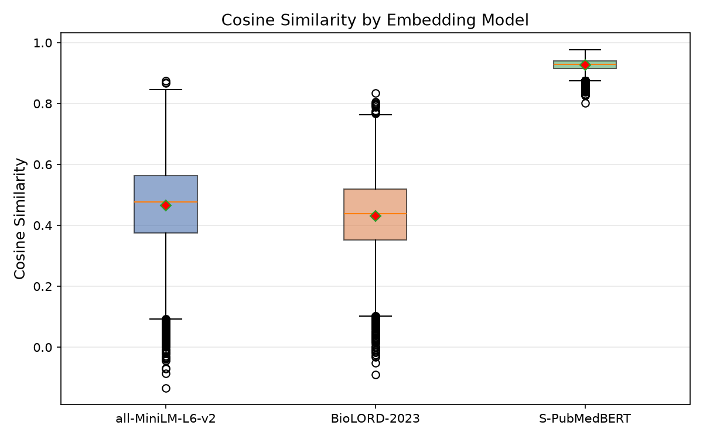

# Full Dataset (v3) Deliverable — Focal Terms Pipeline

**Dataset**: v3_16042026 (full sample)
**Date**: June 2026

---

## Data Sources

| File | Rows | Description |
|---|---|---|
| `FullSampleGloria_Pat_GlinerLabels_16042026.parquet` | 120,274,819 | Patent terms extracted by GLiNER |
| `FullSampleGloria_Link_PmidOa_16042026.parquet` | 26,768,791 | Patent-to-PubMed citation links |
| `FullSampleGloria_Pmed_GlinerLabels_16042026.parquet` | 207,304,318 | PubMed paper terms extracted by GLiNER |

---

## Task 1 — Identify Overlapping Terms ("Focal Terms")

### Method

For each patent:
1. Compile the set of GLiNER-extracted terms appearing in the patent.
2. Compile the set of GLiNER-extracted terms appearing in its cited PubMed papers (via the link table).
3. Identify the intersection of these two term sets.
4. These intersecting terms are the **focal terms** for that patent.

### Deliverable

A dataset (`focal_terms_full.parquet`) listing:

| Column | Type | Description |
|---|---|---|
| `patent_id` | string | Patent identifier |
| `focal_term` | string | The shared term |
| `freq_in_patent` | int | How many times the term appears in the patent |
| `freq_in_cited_paper` | int | Sum of occurrences across all cited papers |

---

## Task 2 — Measure Overlap Intensity

### Summary Statistics

| Statistic | Value |
|---|---|
| Total patents with focal terms | 474,011 |
| Mean focal terms per patent | 8.85 |
| Median focal terms per patent | 6 |
| Standard deviation | 8.66 |
| Min | 1 |
| Max | 158 |
| Patents with exactly 1 focal term | 50,352 (10.6%) |

### Distribution Plot



The distribution is **right-skewed**: the majority of patents share a small number of terms with their cited literature, while a minority overlap very broadly. The median of 6 focal terms per patent is the typical patent-paper relationship. The gap between mean (8.85) and median (6) confirms the skew: a small number of high-overlap patents pull the mean upward.

### Interpretation

- **10.6% of patents** have exactly 1 focal term -- minimal terminological overlap with cited science.
- The bulk of patents cluster between 1-20 focal terms.
- A long tail extends to 158 focal terms, representing patents with exceptionally broad scientific grounding. These are likely highly specialised biomedical/pharmaceutical patents referencing a dense body of scientific literature.

### Top 10 patents by focal-term overlap

| patent_id | num_focal_terms |
|---|---|
| 10493296 | 158 |
| 11505782 | 144 |
| 7111346 | 122 |
| 8206901 | 118 |
| 9109248 | 117 |
| 9821114 | 111 |
| 11065306 | 110 |
| 7666598 | 108 |
| 9679115 | 108 |
| 8389222 | 107 |

### Most frequent focal terms (top 20)

| Focal term | Frequency |
|---|---|
| method | 92,363 |
| cell | 61,388 |
| protein | 44,343 |
| human | 43,944 |
| effective | 37,710 |
| system | 36,647 |
| sequence | 32,576 |
| treatment | 29,180 |
| time | 28,895 |
| compound | 28,163 |

High-frequency terms (`method`, `cell`, `protein`) are generic biomedical vocabulary. More specific terms like `cancer`, `antibody`, `expression` (ranks 17-20) reveal the predominantly life-sciences character of the dataset.

---

## Task 3 — Compare Semantic Contexts

### Method

For each focal term, we extract its **context** -- the set of other GLiNER-extracted terms co-occurring in:
- the patent (patent context)
- the cited scientific papers (paper context)

Both context term lists are concatenated into strings and encoded using a sentence embedding model. Cosine similarity between the two embeddings measures how similar the semantic environment of the focal term is across patents and science.

**Sample size**: 20,000 focal-term pairs (sampled from the full dataset to keep computation feasible).

### Embedding Models

We compare three embedding models to assess how model choice affects the measured semantic similarity:

| Model | Type | Training domain | Strengths |
|---|---|---|---|
| `all-MiniLM-L6-v2` | General-purpose | Web text (NLI + STS) | Fast, widely used baseline |
| `BioLORD-2023` | Biomedical | UMLS ontology + PubMed | Biomedical concept relationships |
| `S-PubMedBERT-MS-MARCO` | Biomedical | PubMed + MS MARCO | Biomedical retrieval tasks |

**Note on input format**: all three models embed concatenated term lists rather than natural language sentences. Sentence embedding models are trained on grammatical text, so feeding them word lists is suboptimal. A future improvement would be to embed actual patent claims and paper sentences containing the focal term.

### Quantitative Summary — Model Comparison

| Statistic | all-MiniLM-L6-v2 | BioLORD-2023 | S-PubMedBERT |
|---|---|---|---|
| N pairs | 20,000 | 20,000 | 20,000 |
| Mean | 0.466 | 0.432 | 0.926 |
| Median | 0.477 | 0.438 | 0.928 |
| Std Dev | 0.141 | 0.122 | 0.020 |
| Q25 | 0.375 | 0.352 | 0.914 |
| Q75 | 0.564 | 0.518 | 0.940 |
| Min | -0.133 | -0.090 | 0.802 |
| Max | 0.874 | 0.834 | 0.977 |
| % above 0.5 | 43.0% | 30.3% | 100.0% |
| % below 0.2 | 4.1% | 3.7% | 0.0% |
| % negative | 0.1% | 0.1% | 0.0% |

### Distribution Plots

#### Overlay comparison



#### Per-model distributions



#### Box plot comparison



### Interpretation

The three models produce strikingly different similarity profiles on the same 20,000 focal-term pairs:

**all-MiniLM-L6-v2** (general-purpose baseline): mean 0.466, bell-shaped distribution centred around 0.45-0.50. This model provides moderate discrimination -- 43% of pairs score above 0.5, while 4.1% fall below 0.2. It serves as a useful baseline but is not optimised for biomedical vocabulary.

**BioLORD-2023** (biomedical, ontology-trained): mean 0.432, slightly lower than MiniLM with a tighter spread (std 0.122 vs 0.141). Despite being a biomedical model, it produces *lower* average similarity than the general-purpose baseline. This likely reflects BioLORD's finer-grained biomedical concept distinctions: it differentiates closely related biomedical terms that MiniLM would conflate, resulting in lower similarity when patent and paper contexts use related but non-identical terminology. Only 30.3% of pairs exceed 0.5, suggesting BioLORD is more conservative in judging context overlap.

**S-PubMedBERT-MS-MARCO** (biomedical retrieval): mean 0.926, with nearly all values compressed into the 0.90-0.95 range (std 0.020). This model shows almost no discrimination between pairs -- even its "lowest" similarity (0.802) is higher than MiniLM's highest (0.874). This behaviour indicates the model maps all biomedical term lists into a small region of embedding space, producing uniformly high cosine similarity regardless of actual semantic overlap. This makes it **unsuitable for this task**: it cannot distinguish genuinely similar contexts from dissimilar ones.

**Key finding**: MiniLM and BioLORD agree on the broad pattern -- moderate average similarity (~0.43-0.47) with meaningful spread -- while S-PubMedBERT lacks the discriminative power needed for this comparison. Between the two usable models, BioLORD's lower mean likely reflects more precise biomedical understanding rather than worse performance.

### Examples: High Similarity

#### all-MiniLM-L6-v2

| Patent | Focal term | Similarity | Patent context (sample) | Paper context (sample) |
|---|---|---|---|---|
| 10005683 | time | 0.874 | treatment, apparatus, nitrogen, reactor, aeration, ammonia | aeration, evaluation, gas, nitrate, nitrogen, anammox |
| 10005683 | growth | 0.869 | treatment, apparatus, nitrogen, reactor, aeration, ammonia | accumulation, bacteria, biological, carbon, control |
| 10004748 | letrozole | 0.868 | treatment, administering, therapeutically effective, breast cancer | aromatase, cancer, inhibitor, safety, chemotherapy |
| 10004748 | anastrozole | 0.845 | treatment, administering, therapeutically effective, breast cancer | analysis, antiestrogen, benefit, clinical, efficacy |
| 10004748 | tamoxifen | 0.842 | treatment, administering, therapeutically effective, breast cancer | aromatase, efficacy, postmenopausal, risk, biosynthesis |

#### BioLORD-2023

| Patent | Focal term | Similarity | Patent context (sample) | Paper context (sample) |
|---|---|---|---|---|
| 10011824 | penicillin | 0.834 | beta-lactamase, amino acid, sequence, identity, residue | acylated, alanine, function, gene, plasmid |
| 10010099 | sweetener | 0.805 | orally consumable, product, sweetening, rebaudioside | aftertaste, food, functional, industry, model |
| 10000791 | activity | 0.801 | measurement, method, human pancreatic lipase, blood | assay, journal, lipase, traceable, method, serum |
| 10004471 | probability | 0.800 | computer-readable, control, method, nodule, region, tissue | computer, differentiate, model, nodule, pathologic |
| 10004788 | ranibizumab | 0.797 | method, treatment, ocular neovascularization, eye, human | action, active, acute, age-related macular degeneration |

#### S-PubMedBERT (note: limited discriminative power)

| Patent | Focal term | Similarity | Patent context (sample) | Paper context (sample) |
|---|---|---|---|---|
| 10013082 | user | 0.977 | customization, haptic, apparatus, computer, processor | experiment, feedback, influence, outcome, paper |
| 10013082 | motion | 0.975 | user, customization, haptic, apparatus, computer | behavior, easy, experience, method, rate |
| 10016532 | sulfobetaine | 0.974 | process, preparation, article, depositing, polymeric | cellulose, compatibility, grafting, improvement |
| 10005683 | time | 0.974 | treatment, apparatus, nitrogen, reactor, aeration | bacteria, effectively, high, intermittent, oxygen |
| 10005683 | reactor | 0.974 | treatment, apparatus, nitrogen, volume, aeration | anammox, bacterial, control, efficiency, high |

High similarity occurs across all models for **domain-specific terms** (drug names, enzymes, chemical compounds) with narrow, stable meanings used the same way in both patents and science. BioLORD's top examples are notably dominated by specific biomedical entities (penicillin, ranibizumab), whereas MiniLM's include more general terms (time, growth).

### Examples: Low Similarity

#### all-MiniLM-L6-v2

| Patent | Focal term | Similarity | Patent context (sample) | Paper context (sample) |
|---|---|---|---|---|
| 10016380 | about | -0.133 | method, treating, solid, smooth, porous, surface, sanitize | cross-sectional, development, smoke, year-old, birth |
| 10011540 | range | -0.086 | method, chemical, oxidative coupling, methane, catalyst | 68-year-old, absent, age, anti-tumor, apoptosis |
| 10016364 | present | -0.071 | method, making, nanoemulsion, premix, oil-based | evaluation, bilaterally, bulbocavernosus, reflex |
| 10008141 | with | -0.068 | light field, display, device, array, element | 1540, age, annual, pediatrics, monomodal |
| 10009240 | from | -0.044 | method, associating, scores, policies, hosts, network | change, geophysics, gravitational, large, measure |

#### BioLORD-2023

| Patent | Focal term | Similarity | Patent context (sample) | Paper context (sample) |
|---|---|---|---|---|
| 10005728 | no | -0.090 | compound, pharmaceutically, salt, hydrocarbon, methylene | discernable, initiate, without, association, cell-death |
| 10005760 | substantially | -0.051 | compound, crystalline, solid, free, having | death, decline, diagnosis, estimate, incidence |
| 10013978 | system | -0.032 | optimize, processing, sequence, operations, computer | appropriate, cause, death, evaluation, issue |
| 10016229 | during | -0.031 | method, alleviating, pain, occipital neuralgia | amount, difference, impairment, intervention, minimal |
| 10000475 | group | -0.024 | compound, salt, cycloalkyl, aryl, heteroaryl | biological, high, landscape, spatial, strontium |

#### S-PubMedBERT (note: "low" scores still very high)

| Patent | Focal term | Similarity | Patent context (sample) | Paper context (sample) |
|---|---|---|---|---|
| 10008738 | up | 0.802 | nanoconfined, metal-containing, electrolyte, layer, enclosed | article, attention, daily, last, measure |
| 10000726 | cleaning | 0.826 | composition, comprising, wt, charged, pei, polymer | invisible, marker, time, improvement, surface |
| 10015515 | picture | 0.827 | method, decoding, intra prediction, blocks, predictive | situation, leishmaniasis, painting, eurosurveillance |
| 10012664 | first | 0.827 | method, transporting, component, sample, device | amantadine, antigenicity, antiviral-resistant, human, lineage |
| 10015489 | group | 0.831 | deriving, prediction unit, receiving, decoder, bitstream | alone, cancer, dose, oxaliplatin, respectively |

Low similarity occurs across MiniLM and BioLORD for **generic/function words** (`about`, `no`, `range`, `substantially`, `with`, `from`) that GLiNER extracted as entities but carry no domain-specific meaning. These terms are focal terms by coincidence -- they appear in both domains but have no shared semantic content. S-PubMedBERT assigns high similarity (>0.80) even to these clearly mismatched pairs, confirming its lack of discrimination.

This highlights an opportunity to improve results by filtering stopwords and non-entity terms from the GLiNER output.

---

## Methodological Note

### Pipeline

1. **Term extraction**: GLiNER named entity recognition applied to patent texts and PubMed abstracts (performed upstream, not part of this pipeline).
2. **Focal term identification** (`01_focal_terms.py`): Inner join between patent terms and cited-paper terms via the patent-PMID link table. Each raw file (120M, 27M, 207M rows) is scanned exactly once using Polars' streaming engine.
3. **Overlap analysis** (`02_analysis.py`): Per-patent focal term counts, summary statistics, and distribution visualisation.
4. **Semantic comparison** (`03_semantic.py`): For a sample of 20,000 focal-term pairs, context term lists are extracted from both patents and papers, embedded with three models (`all-MiniLM-L6-v2`, `BioLORD-2023`, `S-PubMedBERT-MS-MARCO`), and compared via cosine similarity.

### Tools

- **Polars** (v1.41) for data processing -- lazy evaluation and streaming to handle 350M+ rows within GitHub Actions' 7GB RAM constraint.
- **sentence-transformers** for context embeddings: `all-MiniLM-L6-v2` (general-purpose baseline), `FremyCompany/BioLORD-2023` (biomedical ontology model), `pritamdeka/S-PubMedBert-MS-MARCO` (biomedical retrieval model).
- **GitHub Actions** for automated execution; **Cloudflare R2** for data storage.

### Limitations

- The pipeline embeds concatenated term lists rather than natural language sentences. All three models are trained on grammatical text, so term-list input is suboptimal.
- Some GLiNER extractions include stopwords and non-entities (`about`, `with`, `from`, `30`), which add noise. Filtering these would improve both overlap statistics and semantic comparison quality.
- S-PubMedBERT produces uniformly high similarity (~0.93) with near-zero variance, making it ineffective for distinguishing genuinely similar from dissimilar contexts in this setting.

---

## Output Files

```
output/v3_16042026/
  outcomes_01_focal_terms_full.parquet              # Task 1: (patent_id, focal_term, freq_in_patent, freq_in_cited_paper)
  outcomes_02_analysis_full.json                    # Task 2: summary statistics + examples
  outcomes_03_contexts_full.parquet                 # Task 3: context term lists (20k sample)
  outcomes_03_similarity_full.parquet               # Task 3: all-MiniLM-L6-v2 similarity scores
  outcomes_03_similarity_biolord_full.parquet       # Task 3: BioLORD-2023 similarity scores
  outcomes_03_similarity_pubmedbert_full.parquet    # Task 3: S-PubMedBERT similarity scores
  outcomes_03_semantic_summary_full.json            # Task 3: MiniLM summary statistics
  outcomes_03_summary_biolord_full.json             # Task 3: BioLORD summary statistics
  outcomes_03_summary_pubmedbert_full.json          # Task 3: PubMedBERT summary statistics

visualizations/v3_16042026/fullsample_visualizations/
  histogram_focal_terms_full.png                    # Task 2: focal term count distribution
  task3_similarity_distribution.png                 # Task 3: MiniLM similarity distribution
  task3_similarity_comparison_overlay.png           # Task 3: three-model overlay
  task3_similarity_comparison_panels.png            # Task 3: per-model distribution panels
  task3_similarity_comparison_boxplot.png           # Task 3: box plot comparison
```
