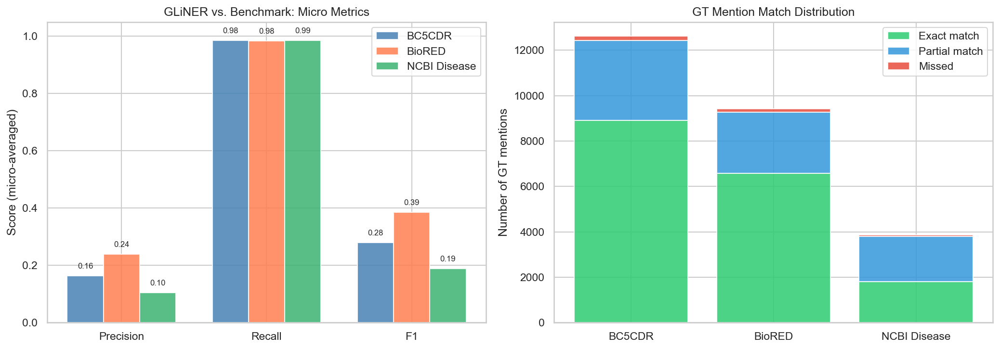
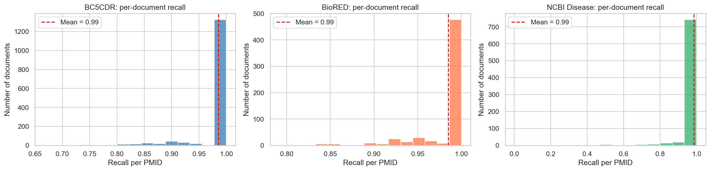
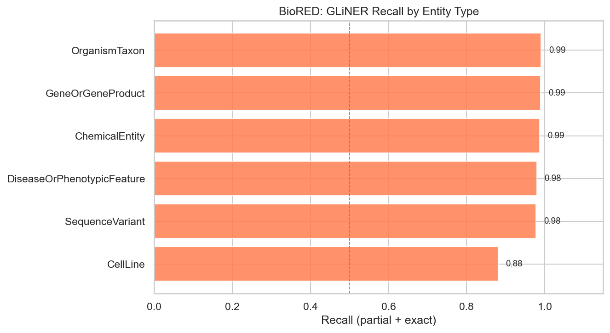
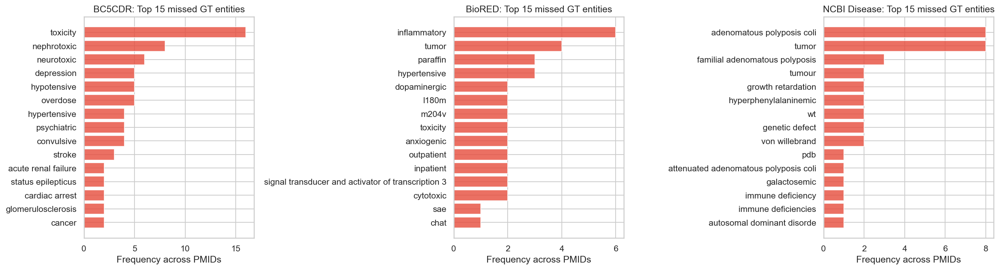

# PubMed GLiNER Validation Against NER Benchmarks — Deliverable

**Notebook:** `notebooks/validation/pubmed_validation.ipynb`
**Date:** 2026-06-05
**Author:** Gloria Galasso

---

## 1. Objective

This validation task evaluates how well **GLiNER** extracts biomedical entity mentions from PubMed abstracts, by comparing GLiNER-extracted terms against three established biomedical NER benchmark datasets. Unlike the patent-side validation, no human annotation was required. The benchmark datasets provide ground truth.

---

## 2. Data Sources

| Source | File / Location | Description |
|--------|----------------|-------------|
| GLiNER PubMed labels (benchmark-specific) | `data/raw/pubmed_validation/specialized_pubmed_samples_with_entities.json` | 3,487 entries; GLiNER labels run specifically on all benchmark PMIDs; sentence-level entity extractions with text, label, score, and character offsets |
| BC5CDR | `data/benchmarks/bc5cdr/CDR.Corpus.v010516/` | Chemical and disease mentions in PubMed abstracts; 1,500 PMIDs |
| BioRED | `data/benchmarks/biored/BioRED/` | 6 entity types (chemicals, diseases, genes, variants, organisms, cell lines); 600 PMIDs |
| NCBI Disease | `data/benchmarks/ncbi_disease/` | Disease name recognition; 792 PMIDs |

**Note on data source:** The initial run used a random PubMed sample (`data/raw/v3_16042026/FullSampleGloria_Pmed_GlinerLabels_16042026.parquet`, 207M rows, 881k PMIDs). That file had very low overlap with the benchmark PMIDs (3–8% for BC5CDR and BioRED, 0% for NCBI Disease), because the benchmarks skew toward pre-2000 articles that were not well represented in the random sample. Without matching PMIDs, no comparison was possible.

`specialized_pubmed_samples_with_entities.json`  contains GLiNER's entity extractions — the same model used on patents, applied here to PubMed abstracts for every PMID in the three benchmarks, achieving 100% coverage.

All three benchmarks are distributed in **PubTator format**:

```
PMID|t|Title text
PMID|a|Abstract text
PMID   start   end   mention   type   concept_id
```

The term extracted is `parts[3]` (the mention span), lowercased and stripped of whitespace.

The JSON file has one entry per article with nested sentence-level entities:

```json
{
  "doc_id": "10491763",
  "source": "BioRED",
  "entities": [
    {
      "sentence_idx": 0,
      "entities": [
        {"text": "diabetes", "label": "Disease or Syndrome", "score": 0.834, "start": 82, "end": 90}
      ]
    }
  ]
}
```

---

## 3. Process

### Step 1 — Read the benchmark datasets

Each benchmark is distributed as a plain-text file in PubTator format. Each line either contains the title or abstract of an article, or one annotated entity mention. For example:

```
227508   naloxone   Chemical
227508   hypertensive   Disease
```

The code reads these files and builds a lookup table: for each article (identified by its PMID), store the list of annotated entity mentions and their types. All mentions are lowercased so that comparisons with GLiNER terms are case-insensitive.

### Step 2 — Load GLiNER labels from the dedicated JSON

Each entry in the JSON represents one article. Entity texts were extracted from all sentences, lowercased, and collected into a set per PMID. For BioRED, some PMIDs appear across multiple splits (train/dev/test); terms from all splits were merged with set union.

### Step 3 — PMID overlap

| Benchmark | Benchmark PMIDs | Overlapping with GLiNER | Overlap % |
|-----------|----------------|------------------------|-----------|
| BC5CDR | 1,500 | 1,500 | 100% |
| BioRED | 600 | 600 | 100% |
| NCBI Disease | 792 | 792 | 100% |

### Step 4 — Match GLiNER terms against ground truth

For each PMID, GLiNER terms were compared against the human-annotated mentions from the benchmark. These are referred to as **GT (ground-truth) mentions** throughout — i.e. the entity mentions that human experts labelled in the benchmark datasets. Two types of match were counted:

- **Exact match**: the GT mention is identical to a GLiNER term
- **Partial match**: a GLiNER term appears as whole words inside the GT mention, or vice versa

Partial matching uses **word-boundary lookarounds** (`(?<!\w)...(?!\w)`) rather than a bare `in` check, to avoid false positives where short noise tokens (e.g. `"no"`) match as substrings of unrelated words. Standard `\b` was not used because it fails for chemical names ending in non-word characters such as parentheses (e.g. `"znso(4)"`).

### Step 5 — Compute metrics

- **Recall** = fraction of GT mentions covered by GLiNER (exact or partial)
- **Precision** = fraction of GLiNER terms that match at least one GT mention
- **F1** = harmonic mean of precision and recall
- Both **micro** (mention-weighted) and **macro** (article-weighted) averages were computed

---

## 4. Results

### 4.1 BC5CDR (1,500 PMIDs)

| Metric | Value |
|--------|-------|
| GT mentions (deduplicated) | 12,614 |
| Exact matches | 8,911 |
| Partial matches | 3,513 |
| Missed | 190 |
| GLiNER terms total | 99,331 |
| GLiNER terms matching ≥1 GT entity | 16,197 |
| **Micro Precision** | **0.163** |
| **Micro Recall** | **0.985** |
| **Micro F1** | **0.280** |
| Macro Precision | 0.178 |
| Macro Recall | 0.986 |
| Macro F1 | 0.293 |

### 4.2 BioRED (600 PMIDs)

| Metric | Value |
|--------|-------|
| GT mentions (deduplicated) | 9,421 |
| Exact matches | 6,587 |
| Partial matches | 2,685 |
| Missed | 149 |
| GLiNER terms total | 49,367 |
| GLiNER terms matching ≥1 GT entity | 11,841 |
| **Micro Precision** | **0.240** |
| **Micro Recall** | **0.984** |
| **Micro F1** | **0.386** |
| Macro Precision | 0.242 |
| Macro Recall | 0.985 |
| Macro F1 | 0.380 |

### 4.3 NCBI Disease (792 PMIDs)

| Metric | Value |
|--------|-------|
| GT mentions (deduplicated) | 3,864 |
| Exact matches | 1,810 |
| Partial matches | 1,999 |
| Missed | 55 |
| GLiNER terms total | 52,115 |
| GLiNER terms matching ≥1 GT entity | 5,455 |
| **Micro Precision** | **0.105** |
| **Micro Recall** | **0.986** |
| **Micro F1** | **0.189** |
| Macro Precision | 0.108 |
| Macro Recall | 0.986 |
| Macro F1 | 0.189 |

### 4.4 BioRED — Recall by Entity Type

| Entity Type | Exact | Partial | Missed | Total | Recall |
|-------------|-------|---------|--------|-------|--------|
| OrganismTaxon | 878 | 23 | 8 | 909 | **0.991** |
| GeneOrGeneProduct | 2,357 | 676 | 31 | 3,064 | **0.990** |
| ChemicalEntity | 1,296 | 299 | 21 | 1,616 | **0.987** |
| DiseaseOrPhenotypicFeature | 1,592 | 1,164 | 57 | 2,813 | **0.980** |
| SequenceVariant | 399 | 513 | 21 | 933 | **0.977** |
| CellLine | 71 | 10 | 11 | 92 | **0.880** |

### 4.5 Match Type Summary

| Benchmark | Matched | Exact | Partial | Partial share | Exact-only recall |
|-----------|---------|-------|---------|---------------|-------------------|
| BC5CDR | 12,424 / 12,614 | 8,911 | 3,513 | 28% | 0.707 |
| BioRED | 9,272 / 9,421 | 6,587 | 2,685 | 29% | 0.699 |
| NCBI Disease | 3,809 / 3,864 | 1,810 | 1,999 | 52% | 0.468 |

---

## 5. Visualizations

### Figure 1 — Micro metrics and match distribution



Left: grouped bar chart comparing micro precision, recall, and F1 for all three benchmarks. Right: stacked bar showing how many GT mentions were matched exactly, partially, or missed per benchmark.

---

### Figure 2 — Per-document recall distribution



Histograms of per-article recall scores for BC5CDR, BioRED, and NCBI Disease, with mean recall marked. Shows the spread of performance across individual articles.

---

### Figure 3 — BioRED recall by entity type



Horizontal bar chart of recall per entity type in BioRED, sorted ascending. All types ≥ 0.88 at full scale; cell lines remain the hardest.

---

### Figure 4 — Top missed entities



Top 15 ground-truth mentions most frequently missed by GLiNER, counted by the number of articles (PMIDs) in which each term was not extracted. A term counts at most once per article even if it appears multiple times in that abstract.

**Note:** a term appearing at the top of this chart does not mean GLiNER is particularly bad at finding it — it may simply be a very common term. For example, "toxicity" was missed in 16 PMIDs but correctly found in 105, giving ~87% recall for that term. The more telling misses are adjective forms such as "nephrotoxic" and "hypertensive", which GLiNER tends to miss because it extracts the noun form ("nephrotoxicity", "hypertension") instead.

---

## 6. Findings

### Finding 1 — Near-perfect recall across all three benchmarks

GLiNER recovers ~98.5% of all ground-truth entity mentions across all three corpora (BC5CDR 0.985, BioRED 0.984, NCBI Disease 0.986). Fewer than 200 mentions per benchmark are missed entirely. This is consistent with the patent validation result (recall 0.99) and confirms that the high-recall pattern is stable across domains and evaluation methodologies.

### Finding 2 — Low precision, driven by entity-type scope mismatch

Precision ranges from 0.105 (NCBI Disease) to 0.240 (BioRED). GLiNER extracts terms across many entity types while each benchmark only annotates a specific subset, so the majority of GLiNER terms count as false positives by the benchmark's standard. NCBI Disease has the lowest precision because it is disease-only: all non-disease GLiNER terms are false positives by definition. BioRED has the highest precision because its six entity types overlap most closely with GLiNER's extraction vocabulary.

### Finding 3 — Partial matching is essential, especially for NCBI Disease

Partial matches account for 28–52% of all matched mentions. NCBI Disease has the highest partial-match share (52%), because disease names in older biomedical literature tend to be long multi-word constructions (*"familial adenomatous polyposis"*, *"adenomatous polyposis coli"*) that GLiNER captures as a substring rather than the full span. Without partial matching, NCBI Disease recall would drop from 0.986 to 0.468.

### Finding 4 — BioRED entity-type recall is uniformly high at full scale

At full coverage all six BioRED entity types achieve recall ≥ 0.88. In the earlier limited-overlap run, cell lines had recall = 0.00 (0/17 annotations). At full scale (92 annotations) they reach 0.880. The remaining gap for cell lines and sequence variants is attributable to long compound identifiers and rare abbreviations that GLiNER does not match even partially.

### Finding 5 — Missed entities follow two distinct patterns

**BC5CDR:** adjective forms of diseases (*"hypertensive"*, *"convulsive"*), multi-token drug names (*"glyceryl trinitrate"*, *"6-OHDA"*), and short ambiguous abbreviations (*"GTN"*, *"FA"*). These are **lexical complexity** failures.

**BioRED:** adjectival modifiers (*"inflammatory"*, *"dopaminergic"*), compound gene identifiers (*"signal transducer and activator of transcription 3"*), and rare abbreviations (*"SAE"*, *"CHAT"*). These are **span-boundary and coverage** failures.

**NCBI Disease:** long disease names (*"adenomatous polyposis coli"* missed 8×, *"familial adenomatous polyposis"* missed 3×), adjective forms (*"hyperphenylalaninemic"*), and abbreviations (*"WT"*, *"PDB"*). Consistent with the NCBI corpus covering older literature with more formal multi-word disease naming conventions.

---

## 7. Comparison with Patent Validation

| Validation setting | Precision | Recall | F1 |
|--------------------|-----------|--------|-----|
| Patents (human annotation, claims only) | 0.27 | 0.99 | 0.42 |
| BC5CDR (chemicals + diseases, 1,500 PMIDs) | 0.163 | 0.985 | 0.280 |
| BioRED (6 entity types, 600 PMIDs) | 0.240 | 0.984 | 0.386 |
| NCBI Disease (diseases only, 792 PMIDs) | 0.105 | 0.986 | 0.189 |

At full scale, PubMed recall (0.984–0.986) is essentially identical to the patent recall (0.99). The earlier lower recall (0.56–0.78 in the limited-overlap run) was a sampling artefact — not a genuine domain difference. Precision is lower on PubMed than on patents because patent annotations covered only focal terms in claim text (a narrow, curated vocabulary), whereas PubMed benchmarks expose the full extent of GLiNER's indiscriminate extraction.

---

## 8. Conclusions

With full benchmark coverage, the evaluation confirms that GLiNER functions as a **near-complete recall extractor** (~98.5%) across all three biomedical NER corpora and both annotation styles (human + benchmark). The high-recall / low-precision profile is robust across domains, corpora, and evaluation designs.

For downstream use in focal-term extraction or literature mining, these results reinforce a **two-stage pipeline**: GLiNER for near-complete candidate generation, followed by a precision-oriented filtering step (entity-type confidence thresholds, a biomedical stop-word list, or minimum span length) to reduce noise before terms are used for indexing or matching.

---

## 9. Output Files

| File | Location | Description |
|------|----------|-------------|
| `benchmark_summary.csv` | `output/validation/pubmed_validation/` | Aggregate metrics for all three benchmarks |
| `bc5cdr_per_pmid.csv` | `output/validation/pubmed_validation/` | Per-PMID evaluation table for BC5CDR (1,500 rows) |
| `biored_per_pmid.csv` | `output/validation/pubmed_validation/` | Per-PMID evaluation table for BioRED (600 rows) |
| `ncbi_per_pmid.csv` | `output/validation/pubmed_validation/` | Per-PMID evaluation table for NCBI Disease (792 rows) |
| `biored_by_entity_type.csv` | `output/validation/pubmed_validation/` | BioRED recall broken down by entity type |
| `metrics_and_match_distribution.png` | `visualizations/validation/pubmed_validation/` | Micro metrics bar chart + match distribution (all 3 benchmarks) |
| `per_pmid_recall_distribution.png` | `visualizations/validation/pubmed_validation/` | Per-document recall histograms (all 3 benchmarks) |
| `biored_recall_by_entity_type.png` | `visualizations/validation/pubmed_validation/` | BioRED recall by entity type |
| `top_missed_entities.png` | `visualizations/validation/pubmed_validation/` | Top missed GT entities (all 3 benchmarks) |
