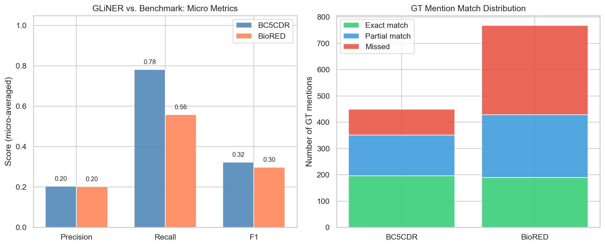
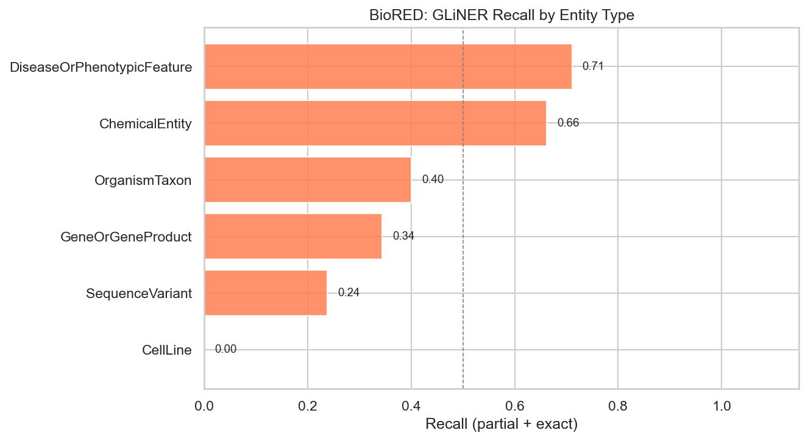
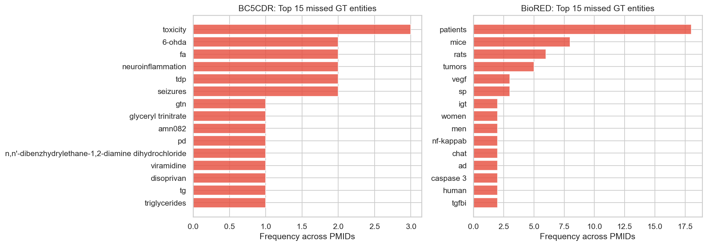

# PubMed GLiNER Validation Against NER Benchmarks — Deliverable

**Notebook:** `notebooks/pubmed_validation.ipynb`
**Date:** 2026-05-29
**Author:** Gloria Galasso

---

## 1. Objective

This validation task evaluates how well **GLiNER** extracts biomedical entity mentions from PubMed abstracts, by comparing GLiNER-extracted terms against three established biomedical NER benchmark datasets. Unlike the patent-side validation, no human annotation was required. The benchmark datasets provide ground truth directly.

---

## 2. Data Sources

| Source | File / Location | Description |
|--------|----------------|-------------|
| GLiNER PubMed labels | `data/raw/FullSampleGloria_Pmed_GlinerLabels_16042026.parquet` | 207M rows, one per (pmid, term); 881,341 unique PMIDs |
| BC5CDR | `data/CDR_Data/CDR.Corpus.v010516/` | Chemical and disease mentions in PubMed abstracts; 1500 PMIDs |
| BioRED | `data/BioRED/BioRED/` | 6 entity types (chemicals, diseases, genes, variants, organisms, cell lines); 600 PMIDs |
| NCBI Disease | `data/NCBIdisease/` | Disease name recognition; 793 PMIDs |

All three benchmarks are distributed in **PubTator format**. Each document has title/abstract lines followed by tab-separated annotation lines:

```
PMID|t|Title text
PMID|a|Abstract text
PMID   start   end   mention   type   concept_id
```

The annotation line has 6 tab-separated fields (0-indexed):

| Index | Field | Example |
|-------|-------|---------|
| 0 | PMID | `8701013` |
| 1 | start offset | `0` |
| 2 | end offset | `10` |
| 3 | **mention** ← extracted | `Famotidine` |
| 4 | entity type | `Chemical` |
| 5 | concept ID | `MESH:D015738` |

The term we extract is **`parts[3]`** (the mention), lowercased and stripped. Character offsets and concept IDs are ignored.

---

## 3. Process

### Step 1 — Parse benchmark datasets

All three benchmark datasets were parsed from PubTator format into a dictionary `{pmid: [(mention, entity_type), ...]}`. Mentions were lowercased and stripped of whitespace. Each benchmark's PMID set was stored separately.

### Step 2 — Find overlapping PMIDs

The set of GLiNER PMIDs was intersected with each benchmark's PMID set. Only overlapping articles can be compared.

| Benchmark | Benchmark PMIDs | Overlapping with GLiNER | Overlap % |
|-----------|----------------|------------------------|-----------|
| BC5CDR | 1500 | 46 | 3.1% |
| BioRED | 600 | 48 | 8.0% |
| NCBI Disease | 793 | 0 | 0.0% |

The NCBI Disease corpus could not be evaluated: its PMIDs cover very old articles (PMID range 23,402–10,987,655, roughly pre-2000) that are almost absent from the GLiNER sample. Of the 881,341 GLiNER PMIDs, only 1,533 fall within that PMID range, and none coincide with the 792 specific NCBI Disease PMIDs.

### Step 3 — Filter GLiNER data

The 207M-row GLiNER file was loaded and immediately filtered to only the ~90 overlapping PMIDs (yielding ~21,000 rows) before building the `{pmid: set(terms)}` dictionary. This avoids running an expensive groupby on the full dataset.

### Step 4 — Match GLiNER terms against ground truth

For each overlapping PMID, GLiNER terms were compared against the deduplicated ground-truth mentions using two criteria:

- **Exact match**: the GT mention equals a GLiNER term (e.g. GT `"headache"` = GLiNER `"headache"`)
- **Partial match**: a GLiNER term appears as whole words inside the GT mention, or vice versa (e.g. GT `"hepatocyte nuclear factor-6"` partially matched by GLiNER `"hnf-6"`)

Partial matching uses **word-boundary lookarounds** (`(?<!\w)...(?!\w)`) rather than a bare Python `in` check. This avoids character-collision false positives where short noise tokens (e.g. `"no"`) inadvertently match as substrings inside unrelated words (e.g. `"ade`**no**`mas"`, `"col`**or**`ectal"`). Standard `\b` word boundaries were not used because they fail for chemical names ending in non-word characters such as parentheses (e.g. `"znso(4)"`), where no word/non-word transition exists.

### Step 5 — Compute metrics

For each PMID and then aggregated across all PMIDs:

- **Recall** = fraction of GT mentions covered by GLiNER (exact or partial)
- **Precision** = fraction of GLiNER terms that match at least one GT mention
- **F1** = harmonic mean of precision and recall
- Both **micro** (mention-weighted) and **macro** (article-weighted) averages were computed

---

## 4. Results

### BC5CDR (46 overlapping PMIDs)

| Metric | Value |
|--------|-------|
| GT mentions (deduplicated) | 449 |
| Exact matches | 196 |
| Partial matches | 155 |
| Missed | 98 |
| GLiNER terms total | 2061 |
| GLiNER terms matching ≥1 GT entity | 420 |
| **Micro Precision** | **0.204** |
| **Micro Recall** | **0.782** |
| **Micro F1** | **0.323** |
| Macro Precision | 0.207 |
| Macro Recall | 0.790 |
| Macro F1 | 0.318 |

### BioRED (48 overlapping PMIDs)

| Metric | Value |
|--------|-------|
| GT mentions (deduplicated) | 768 |
| Exact matches | 190 |
| Partial matches | 239 |
| Missed | 339 |
| GLiNER terms total | 2304 |
| GLiNER terms matching ≥1 GT entity | 467 |
| **Micro Precision** | **0.203** |
| **Micro Recall** | **0.559** |
| **Micro F1** | **0.297** |
| Macro Precision | 0.228 |
| Macro Recall | 0.552 |
| Macro F1 | 0.309 |

### BioRED — Recall by Entity Type

| Entity Type | Exact | Partial | Missed | Total | Recall |
|-------------|-------|---------|--------|-------|--------|
| DiseaseOrPhenotypicFeature | 66 | 97 | 48 | 211 | 0.773 |
| ChemicalEntity | 66 | 30 | 40 | 136 | 0.706 |
| OrganismTaxon | 28 | 14 | 43 | 85 | 0.494 |
| GeneOrGeneProduct | 28 | 76 | 152 | 256 | 0.406 |
| SequenceVariant | 2 | 22 | 39 | 63 | 0.381 |
| CellLine | 0 | 0 | 17 | 17 | 0.000 |

---

## 5. Visualizations

### Figure 1 — Micro metrics and match distribution



Left: grouped bar chart comparing micro precision, recall, and F1 for BC5CDR and BioRED. Right: stacked bar showing how many GT mentions were matched exactly, partially, or missed per benchmark.

---

### Figure 2 — Per-document recall distribution


Histogram of per-article recall scores for BC5CDR (left) and BioRED (right), with the mean recall marked. Shows the spread across individual articles rather than just the aggregate.

---

### Figure 3 — BioRED recall by entity type



Horizontal bar chart of recall per entity type in BioRED, sorted ascending. Diseases and chemicals are well covered; cell lines have zero recall.

---

### Figure 4 — Top missed entities



Top 15 most frequently missed ground-truth mentions for BC5CDR (left) and BioRED (right), by number of articles they appear in but are not captured by GLiNER.

---

## 6. Findings

### Finding 1 — High recall, low precision — consistent with patent validation

On both benchmarks GLiNER exhibited a consistent high-recall / low-precision profile (precision ~0.20, recall 0.56–0.78). This is consistent with the patent validation result (precision 0.27, recall 0.99). The pattern holds across two independent domains and two evaluation methodologies, confirming that GLiNER is a broad, noisy first-pass extractor regardless of domain.

### Finding 2 — Recall is lower than in the patent validation

Recall on PubMed (0.49–0.74) is lower than on patents (0.99) due to two factors:
1) Biomedical names are longer and more compositional (meaning GLiNER often divides a single concept into multiple words).
2) BioRED contains highly specialized entities (cell lines, variants, gene symbols) absent from patent claims.

### Finding 3 — Partial matching accounts for the majority of covered mentions

Partial matches account for 44% of all matched GT mentions in BC5CDR (155/351) and 56% in BioRED (239/429). Without partial matching, recall would drop sharply:

| Benchmark | Recall (exact + partial) | Recall (exact only) |
|-----------|--------------------------|---------------------|
| BC5CDR | 0.782 | 0.437 (196/449) |
| BioRED | 0.559 | 0.247 (190/768) |

This confirms that GLiNER systematically fragments multi-word entity names into single-word tokens. Partial matching is necessary to fairly assess coverage.

### Finding 4 — Recall varies strongly by entity type

Diseases and chemicals are well covered (0.71–0.77) because their surface forms are shorter and common. Genes and variants are poorly covered (0.38–0.41) because they appear as specialised symbols or long compound identifiers. Cell lines have zero recall (0/17): names such as *HeLa*, *MCF-7*, *HEK293* are highly specific laboratory codes that do not appear in the GLiNER output at all.

### Finding 5 — Top missed entities reveal two distinct failure modes

**BC5CDR missed:** multi-token drug names (*glyceryl trinitrate*, *6-OHDA*, *cyproterone acetate*) and short abbreviations (*FA*, *GTN*, *TDP*, *CHF*). These are failures of **lexical complexity** — entities that are too long to extract as a unit or too short/ambiguous to extract reliably.

**BioRED missed:** organism mentions (*patients* ×13, *mice* ×8, *rats* ×5) — absent from the GLiNER output, suggesting upstream filtering removed them as too generic. Also gene symbols (*VEGF*, *NF-κB*, *GLUT2*) and cell lines (*HEK293*, *HeLa*). These are failures of **entity-type coverage** — categories that GLiNER never extracts regardless of surface form.

These are structurally distinct failure modes that would require different remediation strategies.

---

## 7. Comparison with Patent Validation

| Setting | Precision | Recall | F1 |
|---------|-----------|--------|-----|
| Patents (human annotation, claims only) | 0.27 | 0.99 | 0.42 |
| BC5CDR benchmark (chemicals + diseases) | 0.20 | 0.78 | 0.32 |
| BioRED benchmark (6 entity types) | 0.20 | 0.56 | 0.30 |

The core pattern is consistent across both domains. Precision is slightly lower on PubMed (0.20 vs. 0.27), consistent with abstracts containing more generic scientific vocabulary that GLiNER incorrectly extracts as entities.

---

## 8. Conclusions

GLiNER functions as a **broad, noisy first-pass extractor**: it achieves high recall for common entity types (diseases, chemicals) but systematically misses specialised identifiers (cell lines, gene symbols, abbreviations), and produces low precision due to indiscriminate extraction of generic tokens. These properties are robust across two independent domains and two evaluation designs.

For downstream use in focal-term extraction or literature mining, these results support a **two-stage pipeline**: GLiNER for high-recall candidate generation, followed by a precision-oriented filtering step — for example, a minimum term-length threshold, a biomedical stop-word list, or entity-type confidence filtering — to remove noise before terms are used for indexing or matching.

---

## 9. Output Files

| File | Location | Description |
|------|----------|-------------|
| `bc5cdr_per_pmid.csv` | `output/pubmed_validation/` | Per-PMID evaluation table for BC5CDR |
| `biored_per_pmid.csv` | `output/pubmed_validation/` | Per-PMID evaluation table for BioRED |
| `biored_by_entity_type.csv` | `output/pubmed_validation/` | BioRED recall broken down by entity type |
| `benchmark_summary.csv` | `output/pubmed_validation/` | Aggregate metrics for all three benchmarks |
| `metrics_and_match_distribution.png` | `visualizations/pubmed_validation/` | Micro metrics bar chart + match distribution |
| `per_pmid_recall_distribution.png` | `visualizations/pubmed_validation/` | Per-document recall histograms |
| `biored_recall_by_entity_type.png` | `visualizations/pubmed_validation/` | BioRED recall by entity type |
| `top_missed_entities.png` | `visualizations/pubmed_validation/` | Top missed GT entities (BC5CDR and BioRED) |
