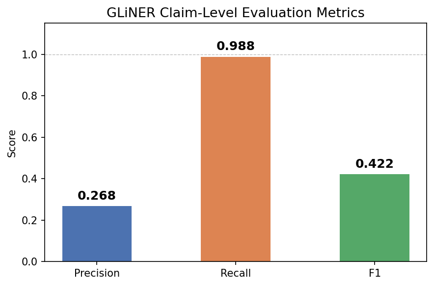
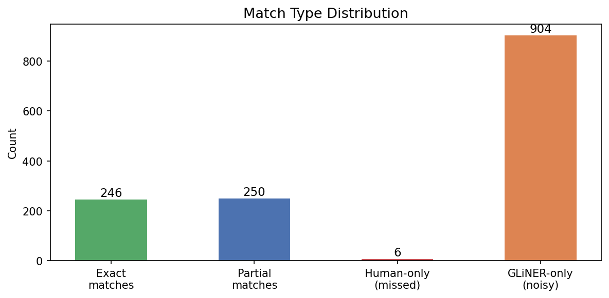
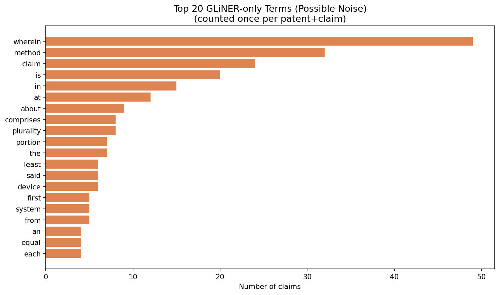
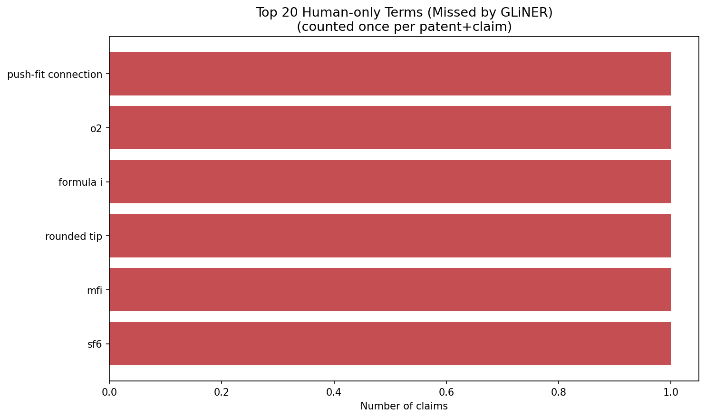

# GLiNER Claim-Level Validation — Deliverable

**Notebook:** `notebooks/task_claim.ipynb`
**Date:** 2026-05-10
**Annotator:** Gloria Galasso

---

## 1. Objective

This validation task evaluates how well **GLiNER** extracts meaningful scientific and technical terms from patent claims, and how accurately it assigns semantic labels to them.

The goal is **not** strict biomedical NER evaluation. The aim is to assess whether GLiNER identifies the kind of conceptually meaningful "idea terms" that matter for the focal-term pipeline as opposed to generic linguistic filler.

---

## 2. Data Sources

| Source | File | Description |
|--------|------|-------------|
| Claims | `data/raw/C15_claims_2019.parquet` | One row per patent claim: `patent_id`, `claim_text`, `claim_number` |
| GLiNER labels | `data/raw/FullSampleGloria_Pat_GlinerLabels_16042026.parquet` | One row per extracted term: `patent_id`, `term`, `label`, `GrantedDate` |
| Human annotations | `data/annotation/annotated_human_claim_annotations_compact_100.csv` | Manually annotated compact format (one row per claim) |
| GLiNER outputs | `data/annotation/gliner_claim_terms_100.csv` | GLiNER terms matched to sampled claims (one row per term) |

### Patent year distribution

The 100 sampled claims come from patents granted between **2010 and 2019**, drawn from the full combined dataset filtered to `GrantedDate ≥ 2000`. The sample (seed=42) happened to fall entirely within this decade.

| Year | Claims |
|------|--------|
| 2010 | 4 |
| 2011 | 9 |
| 2012 | 5 |
| 2013 | 7 |
| 2014 | 14 |
| 2015 | 14 |
| 2016 | 12 |
| 2017 | 8 |
| 2018 | 13 |
| 2019 | 14 |

---

## 3. Process

### Step 1 — Sampling

100 individual patent claims were drawn at random (`seed=42`) from claims whose `patent_id` appears in the GLiNER dataset and whose `GrantedDate ≥ 2000`. Each claim belongs to a different patent (100 unique patents).

### Step 2 — GLiNER term extraction

GLiNER runs at **patent level**, so its outputs cover all text sections (title, abstract, description, claims). To make the comparison fair — humans only read the claim text — GLiNER terms were filtered to those that appear as a **case-insensitive substring** of the sampled `claim_text`. This produced `gliner_claim_terms_100.csv`.

### Step 3 — Human annotation

Each of the 100 claims was manually annotated. For each claim, the annotator:
- Read the claim text
- Identified meaningful scientific/technical terms
- Assigned an approximate semantic label from the GLiNER/UMLS label inventory (127 labels from Gliner!!!!!!)
- Entered terms and labels as semicolon-separated values in `annotated_human_claim_annotations_compact_100.csv`

**Annotation philosophy:** labels are approximate semantic categories. The closest reasonable GLiNER/UMLS category was chosen, prioritising semantic fit over ontological precision.

### Step 4 — Format conversion

Human annotations were converted from compact format (one row per claim, semicolon-separated terms) to long format (one row per term) in `human_claim_annotations_long_100.csv`. Term normalization applied: lowercase, strip whitespace, collapse internal spaces.

### Step 5 — Comparison

For each human-annotated term, a match was sought among GLiNER terms within the same `patent_id + claim_number`:

- **Exact match**: normalized strings are identical
- **Partial match**: one term contains the other as a substring (e.g., `growth factor` ↔ `platelet-derived growth factor`)

For matched terms, human and GLiNER labels were compared (`label_match = yes/no`).

### Step 6 — GLiNER-only and human-only terms

- **GLiNER-only**: GLiNER terms with no exact or partial overlap with any human term in the same claim → saved to `gliner_only_terms_100.csv`
- **Human-only**: human terms with no match in GLiNER → saved to `human_only_terms_100.csv`

### Step 7 — Metrics and outputs

Precision, recall, F1, and label accuracy were computed. Qualitative analysis and visualisations were produced and saved to `visualizations/validation_visualizations/`.

---

## 4. Summary Metrics

| Metric | Value |
|--------|-------|
| Human-annotated terms | 502 |
| GLiNER terms (unique per claim) | 1 848 |
| Exact matches | 246 |
| Partial matches | 250 |
| Total matched (exact + partial) | 496 |
| Human-only terms (missed by GLiNER) | 6 |
| GLiNER-only terms (no human match) | 904 |
| **Precision** | **0.27** |
| **Recall** | **0.99** |
| **F1 score** | **0.42** |
| Label accuracy (matched terms) | 0.34 (169 / 496) |

---

## 5. Findings

### Finding 1 — Near-perfect recall, low precision

GLiNER identified **496 out of 502** human-annotated terms (recall = 0.99). Only 6 human terms were missed entirely:

| Missed term | Type |
|-------------|------|
| `sf6` | Chemical abbreviation |
| `o2` | Chemical abbreviation |
| `mfi` | Domain-specific acronym |
| `formula i` | Chemical formula reference |
| `rounded tip` | Compound physical descriptor |
| `push-fit connection` | Compound mechanical term |

These are edge cases: short abbreviations and compound phrases that GLiNER does not extract. For the focal-term pipeline, this near-perfect recall is a strong result — almost no meaningful concept is lost.

However, GLiNER produced **1 848 terms** across 100 claims, compared to **502** from humans — roughly **3.7× more**. Of these, **904 had no human counterpart** (precision = 0.27). Low precision is the dominant problem.

### Finding 2 — Noise is dominated by patent legal boilerplate

The most frequent GLiNER-only terms are not technical concepts but structural words from patent claim language:

| Term | Claims | GLiNER label | Note |
|------|--------|-------------|------|
| `wherein` | 49 | Laboratory Procedure | Legal connector |
| `method` | 32 | Activity | Patent structural word |
| `claim` | 24 | Intellectual Product | Self-referential |
| `is` | 20 | Spatial Concept | Stop word |
| `in` | 15 | Spatial Concept | Stop word |
| `at` | 12 | Spatial Concept | Stop word |
| `about` | 9 | Spatial Concept | Stop word |
| `plurality` | 8 | Quantitative Concept | Patent boilerplate |
| `comprises` | 8 | Functional Concept | Patent boilerplate |
| `the` | 7 | Spatial Concept | Stop word |

**Implication:** a simple post-processing filter (minimum term length ≥ 3 characters, removal of a patent boilerplate stop list) would remove a large share of these false positives and substantially improve precision.

### Finding 3 — Half of matches are partial (span boundary problem)

Of the 496 matched terms:
- **246 (49.6%)** were exact matches
- **250 (50.4%)** were partial matches

This reveals a systematic **span boundary problem**: GLiNER consistently identifies the right concept family but extracts an incomplete or over-extended span. Examples:

| Human term | GLiNER term | Direction |
|------------|------------|-----------|
| `platelet-derived growth factor` | `growth factor` | GLiNER too short |
| `dimethyl carbonate` | `carbonate` | GLiNER too short |
| `insulin growth factor one` | `insulin` | GLiNER too short |
| `bone morphogenetic protein 2` | `bmp-2` | GLiNER abbreviation only |

Partial matches are treated as successful retrieval in this evaluation since the correct concept is identified, but span quality may matter for downstream tasks that require exact entity boundaries.

### Finding 4 — Label accuracy is low but confusions are systematic and near-adjacent

Label accuracy among matched terms is **0.34** (169 correct labels out of 496 matched terms). The most frequent mismatches:

| Human label | GLiNER label | Count | Nature |
|-------------|-------------|-------|--------|
| Organic Chemical | Chemical | 36 | Hierarchical (broader vs narrower) |
| Manufactured Object | Physical Object | 25 | Near-adjacent category |
| Gene or Genome | Immunologic Factor | 14 | Functional vs structural |
| Manufactured Object | Medical Device | 11 | Contextual specialisation |
| Body Part, Organ, or Organ Component | Anatomical Structure | 5 | Hierarchical |
| Manufactured Object | Cell Component | 5 | Contextual misclassification |

**Important context:** the largest single source of label disagreement — **Organic Chemical → Chemical (36 cases)** — is a hierarchy disagreement rather than a semantic error. Both labels correctly identify the entity as a chemical entity; the difference is only in specificity. Similarly, Manufactured Object ↔ Physical Object and Body Part ↔ Anatomical Structure are near-adjacent category pairs. True semantic errors (e.g., Gene or Genome → Immunologic Factor) are less frequent.

---

## 6. Visualisations

All plots saved to `visualizations/validation_visualizations/`.

### A. Evaluation metrics bar chart

Bar chart showing precision (0.268), recall (0.988), and F1 (0.422). Visually illustrates the strong imbalance between recall and precision. Useful for thesis discussion of GLiNER's extraction behaviour.

### B. Match type distribution

Bar chart with four categories: exact matches (246), partial matches (250), human-only terms (6), GLiNER-only terms (904). Clearly shows that the dominant issue is GLiNER over-extraction (904 terms) rather than under-extraction (6 missed terms).

### C. Top 20 GLiNER-only terms

Horizontal bar chart of the 20 most frequent GLiNER-only terms, counted once per patent+claim. Dominated by patent boilerplate words (`wherein`, `method`, `claim`). Illustrates the noise pattern for thesis discussion.

CSV: `output/validation_outputs/top_noisy_gliner_terms_100.csv`

### D. Top 20 human-only terms

Horizontal bar chart of human-annotated terms not found by GLiNER. Very few (6 total, all appearing once). Confirms that GLiNER misses very little meaningful content.

CSV: `output/validation_outputs/top_missed_human_terms_100.csv`

---

## 7. Output Files

| File | Location | Description |
|------|----------|-------------|
| `human_claim_annotations_long_100.csv` | `data/annotation/` | Human annotations in long format (1 row per term) |
| `gliner_claim_terms_100.csv` | `data/annotation/` | GLiNER terms matched to sampled claims |
| `claim_level_evaluation_100.csv` | `data/annotation/` | Full evaluation table (1 row per human term, with match type and label match) |
| `gliner_only_terms_100.csv` | `data/annotation/` | GLiNER terms with no human counterpart |
| `human_only_terms_100.csv` | `data/annotation/` | Human terms missed by GLiNER |
| `metrics_barplot_100.png` | `visualizations/validation_visualizations/` | Precision / Recall / F1 bar chart |
| `match_distribution_100.png` | `visualizations/validation_visualizations/` | Match type distribution chart |
| `top_noisy_gliner_terms_100.png` | `visualizations/validation_visualizations/` | Top 20 GLiNER-only terms chart |
| `top_missed_human_terms_100.png` | `visualizations/validation_visualizations/` | Top 20 human-only terms chart |
| `top_noisy_gliner_terms_100.csv` | `output/validation_outputs/` | Top 20 GLiNER-only terms table |
| `top_missed_human_terms_100.csv` | `output/validation_outputs/` | Top 20 human-only terms table |

---

## 8. Conclusions and Implications for the Focal-Term Pipeline

**GLiNER is suitable as a high-recall first-pass extractor.** With recall = 0.99 on 100 manually annotated claims, it misses almost no meaningful technical or scientific concept. For a pipeline whose goal is to identify which patents share idea terms with scientific literature, this is the more critical metric.

**Noise filtering is the main task.** The 904 GLiNER-only terms — dominated by patent legal boilerplate — represent the primary failure mode. A targeted post-processing step should:
1. Remove terms shorter than a minimum character length (e.g., ≤ 2 characters)
2. Apply a patent boilerplate stop list (`wherein`, `claim`, `method`, `plurality`, `comprises`, etc.)
3. Optionally filter terms with highly generic GLiNER labels (`Spatial Concept`, `Temporal Concept`, `Quantitative Concept`) unless accompanied by a meaningful noun

**Span boundaries are imprecise.** For the focal-term pipeline, partial matches (GLiNER extracts a substring or superstring of the human term) are likely acceptable in most cases, since the correct conceptual entity is identified. Tasks requiring exact entity boundaries would need additional span refinement.

**Label agreement is limited but systematic.** For downstream tasks that rely on semantic labels (e.g., filtering to only chemical entities or medical devices), GLiNER's label assignment should be treated as approximate. The most reliable labels appear to be those for well-defined ontological categories (Chemical, Anatomical Structure, Medical Device); the weakest are for abstract functional categories (Spatial Concept, Functional Concept) which GLiNER over-applies to non-conceptual terms.
